# PerfectDocRoot API

[](LICENSE)


---

## PerfectDocRoot turns AI prompt calls into governed executions.

**Traditional AI systems:**
prompt → response

**PerfectDocRoot:**

input → contract validation → execution worker → artifacts + provenance → inspectable run

Unlike traditional AI that offers simple prompt-response interactions, **PerfectDocRoot enforces a structured, traceable process**.

---

## ⚡ 60-Second Local Demo

Run PerfectDocRoot locally and generate a governed execution.

```bash
git clone https://github.com/rob-voigt/perfectdocroot-api
cd perfectdocroot-api

cp .env.example .env.local

cd app
npm install
cd ..

npm run bootstrap
npm run start-api
```

Then generate your first governed run:

```bash
cd examples/pdr-minimal-example
cp .env.example .env
npm install
npm start
```

Open the admin console:

```
http://127.0.0.1:3000/admin/runs
```

You should now see your first **governed execution**.

---

## Current Capabilities

PerfectDocRoot currently supports:

- Contract-validated workflow executions
- Async execution worker engine
- Artifact storage and provenance tracking
- Admin console for run inspection
- Local developer runtime with example workflows

---

## Core Concepts

| Concept     | Description                          |
|-------------|--------------------------------------|
| Contracts   | schemas that define structured expectations |
| Runs        | governed workflow executions         |
| Artifacts   | evidence produced during execution   |
| Provenance  | full lineage of inputs, steps, and outputs |

---

## Why PerfectDocRoot Exists

Most AI systems today operate through simple prompt interactions:

```text
prompt → response
```

This approach is powerful, but it introduces serious challenges in production systems:

* nondeterministic behavior
* limited traceability
* weak governance
* difficult auditing
* unclear provenance

PerfectDocRoot introduces a **governed execution model** for AI-assisted workflows.

Instead of a prompt-response loop, executions run through validated contracts and structured execution steps:

```text
Input Payload
    ↓
Contract Validation
    ↓
Execution Worker
    ↓
Artifacts Generated
    ↓
Provenance Recorded
    ↓
Inspectable Run
```

Every run becomes a **traceable execution record**, not an opaque AI response.

---

## What PerfectDocRoot Provides

PerfectDocRoot introduces a governed execution model for AI-assisted systems.
Instead of prompt → response, executions operate through validated contracts,
traceable inputs, and verifiable provenance artifacts.

PerfectDocRoot sits between your application and AI systems, turning opaque AI responses into **validated, traceable workflow executions.**

Developers can run PerfectDocRoot locally in minutes and observe a complete
governed execution lifecycle.

---

## How PerfectDocRoot Works

```mermaid
flowchart LR

A[Application Code] --> B[PDR Run API]

B --> C[Contract Validation]

C --> D[Execution Worker]

D --> E[Processing / AI Step]

E --> F[Execution Steps Logged]

F --> G[Artifacts Stored]

G --> H[Provenance Generated]

H --> I[Admin Console Inspection]

I --> J["/admin/runs"]
```



---

## 🚀 Developer Quick Start

Run PerfectDocRoot locally and generate your first governed execution in minutes.

### 1. Clone the Repository

```bash
git clone https://github.com/rob-voigt/perfectdocroot-api
cd perfectdocroot-api
```

### 2. Configure Your Local Environment

Copy the environment template:

```bash
cp .env.example .env.local
```

Edit `.env.local` and set your database credentials:

```
DB_HOST=127.0.0.1
DB_USER=your_mysql_user
DB_PASS=your_mysql_password
DB_NAME=pdr_api_public
```

### 3. Install Dependencies

```bash
cd app
npm install
cd ..
```

### 4. Bootstrap the Database

Create the database schema and seed the example contracts:

```bash
npm run bootstrap
```

Expected output:

```
PerfectDocRoot DB Bootstrap
Schema imported
[seed] inserted healthcare contracts: 0.2 and 0.1
Bootstrap complete
```

### 5. Start the API

```bash
npm run start-api
```

The API should start on:

```
http://127.0.0.1:3000
```

Open the admin console:

```
http://127.0.0.1:3000/admin/runs
```

You will not see any runs yet — that is expected.

### 6. Generate Your First Governed Run

Open a second terminal and run the minimal example:

```bash
cd examples/pdr-minimal-example
cp .env.example .env
npm install
npm start
```

You should see:

```
Creating governed run...
Run created successfully
```

### 7. Inspect the Run

Refresh the admin console:

```
http://127.0.0.1:3000/admin/runs
```

You will now see your first governed execution.

Click the run to inspect:

* validation results
* execution steps
* artifacts
* provenance data

---

### What Just Happened

You executed a **governed AI workflow**:

```
Application
   ↓
PDR Run API
   ↓
Contract Validation
   ↓
Execution Worker
   ↓
Artifacts + Provenance
   ↓
Admin Console Inspection
```

PerfectDocRoot turns opaque AI calls into **auditable workflow executions**.

---

## Example Governed Run

Every PerfectDocRoot workflow produces a structured execution record.

Example run summary:

```json
{
  "id": "988181cb-4bcb-4dde-a6f3-24810a2d21be",
  "domain_id": "healthcare",
  "contract_version": "0.2",
  "status": "succeeded",
  "validation_report": {
    "pass": true,
    "score": 100
  },
  "result": {
    "candidate": {
      "hello": "world",
      "goodbye": "moon"
    }
  },
  "provenance": {
    "seed_hash": "39e6707b91f718ffddc58aa16f8b0c54",
    "input_hash": "360ca77ff02df8a8802329a59b2154fa"
  }
}
```

Each run also produces:

- execution_steps
- validation_reports
- artifacts
- provenance records


These can be inspected through the admin console:


http://127.0.0.1:3000/admin/runs

---

## Example Use Cases

PerfectDocRoot can govern many types of AI workflows.

Examples include:

#### AI Document Processing

Convert unstructured documents into validated structured outputs.

#### Cybersecurity Risk Analysis

Generate structured vendor risk reports with traceable reasoning.

#### Healthcare Compliance Review

Validate clinical or regulatory documentation against contract schemas.

#### Safety Audits

Analyze uploaded reports or images and produce structured findings.

---

## Architecture Overview

PerfectDocRoot introduces a governance layer for AI execution.

```
Application Backend
│
▼
PDR API
│
▼
Execution Workers
│
▼
Artifacts + Provenance
```

Core platform concepts:

| Component | Purpose |
|------|------|
| Contracts | Define structured input/output expectations |
| Runs | Governed workflow executions |
| Artifacts | Evidence generated during runs |
| Provenance | Full execution lineage |
| Workers | Async execution engine |

---

## Admin Console

PDR includes an operator interface for inspecting workflows.

Example pages:

```
/admin/contracts
/admin/runs
/admin/runs/:id
/admin/workers
```

The console allows developers to inspect:

- run lifecycle
- validation reports
- execution steps
- artifacts
- provenance

---

## Repository Structure

```
perfectdocroot/
│
├── app/                     # core runtime
├── examples/                # developer examples
│   └── pdr-minimal-example
├── contracts/               # contract schema examples
├── docs/                    # architecture documentation
└── scripts/                 # development utilities
```

If you're new, start here:

```
examples/pdr-minimal-example
```

---

## Project Status

PerfectDocRoot is currently in **developer preview**.

Recent milestones include:

- governed run lifecycle
- artifact storage
- execution worker engine
- contract resolution
- operator admin console

The focus now is **developer adoption and ecosystem growth**.

---

## Roadmap

The platform will evolve in three layers:

```
Layer 1 — PDR Runtime (Open Source)
Layer 2 — Developer Ecosystem
Layer 3 — PDR Cloud Platform
```

Future work includes:

- CLI tooling
- developer SDK
- domain packs
- hosted artifact infrastructure

---

## Documentation

Additional documentation is available in:

```
docs/
```

Topics include:

- execution lifecycle
- contract model
- artifact lineage
- provenance architecture

---

## Contributing

Contributions, issues, and developer feedback are welcome.

If you experiment with PerfectDocRoot in your own project, we'd love to hear about it.

---

### Jump To

- 🚀 Quick Start → [Local Demo Setup](#quick-start-local-demo-setup)
- 📖 Architecture → [Architecture Overview](#architecture-overview)
- 🧪 Example → [pdr-minimal-example](examples/pdr-minimal-example)

---

## License

[](LICENSE)
