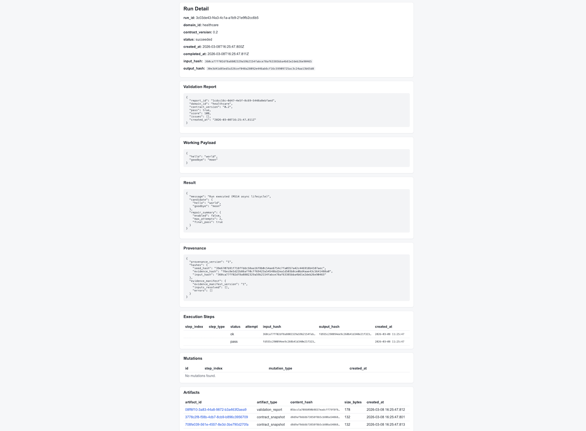
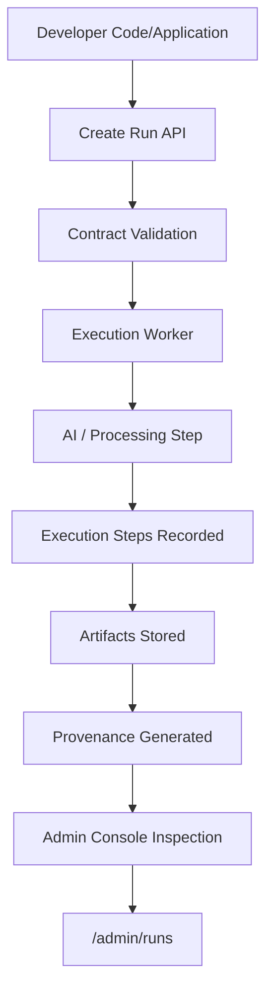

# PerfectDocRoot API

[](LICENSE)


#### Governance infrastructure for AI workflows

PerfectDocRoot introduces a governed execution model for AI-assisted systems.
Instead of prompt → response, executions operate through validated contracts,
traceable inputs, and verifiable provenance artifacts.

PerfectDocRoot sits between your application and AI systems, turning opaque AI responses into **validated, traceable workflow executions.**

Developers can run PerfectDocRoot locally in minutes and observe a complete
governed execution lifecycle.

---

## 5-Minute Demo

Clone and run the API locally:

```bash
cd app
npm install
npm start
```

Then open:
<http://127.0.0.1:3000/admin/runs>

You will immediately see a governed execution run, including:

• input payload
• validation report
• execution steps
• result
• provenance hashes
• generated artifacts

This demonstrates the PerfectDocRoot governed execution model.

---

## Inspect Every AI Run

PerfectDocRoot records validation results, artifacts, and provenance for every workflow execution.



---

## The Problem

Most AI systems operate through free-form prompts.

This creates challenges:

- no deterministic behavior
- limited traceability
- weak governance
- difficult auditing

---

## The PerfectDocRoot Model

PerfectDocRoot replaces prompt execution with governed runs.

Execution flow:

```
Input Payload
→ Contract Validation
→ Execution
→ Provenance Recording
→ Artifact Generation
```

---

## Governed Execution Model



---

## Example Governed Run

Every PerfectDocRoot workflow produces a structured execution record.

Example run summary:

```json
{
  "id": "988181cb-4bcb-4dde-a6f3-24810a2d21be",
  "domain_id": "healthcare",
  "contract_version": "0.2",
  "status": "succeeded",
  "validation_report": {
    "pass": true,
    "score": 100
  },
  "result": {
    "candidate": {
      "hello": "world",
      "goodbye": "moon"
    }
  },
  "provenance": {
    "seed_hash": "39e6707b91f718ffddc58aa16f8b0c54",
    "input_hash": "360ca77ff02df8a8802329a59b2154fa"
  }
}
```

Each run also produces:

- execution_steps
- validation_reports
- artifacts
- provenance records


These can be inspected through the admin console:


http://127.0.0.1:3000/admin/runs


## Example Use Cases

PerfectDocRoot can govern many types of AI workflows.

Examples include:

### AI Document Processing

Convert unstructured documents into validated structured outputs.

### Cybersecurity Risk Analysis

Generate structured vendor risk reports with traceable reasoning.

### Healthcare Compliance Review

Validate clinical or regulatory documentation against contract schemas.

### Safety Audits

Analyze uploaded reports or images and produce structured findings.

---

## Architecture Overview

PerfectDocRoot introduces a governance layer for AI execution.

```
Application Backend
│
▼
PDR API
│
▼
Execution Workers
│
▼
Artifacts + Provenance
```

Core platform concepts:

| Component | Purpose |
|------|------|
| Contracts | Define structured input/output expectations |
| Runs | Governed workflow executions |
| Artifacts | Evidence generated during runs |
| Provenance | Full execution lineage |
| Workers | Async execution engine |

---

## Admin Console

PDR includes an operator interface for inspecting workflows.

Example pages:

```
/admin/contracts
/admin/runs
/admin/runs/:id
/admin/workers
```

The console allows developers to inspect:

- run lifecycle
- validation reports
- execution steps
- artifacts
- provenance

---

## Repository Structure

```
perfectdocroot/
│
├── app/                     # core runtime
├── examples/                # developer examples
│   └── pdr-minimal-example
├── contracts/               # contract schema examples
├── docs/                    # architecture documentation
└── scripts/                 # development utilities
```

If you're new, start here:

```
examples/pdr-minimal-example
```

---

## Project Status

PerfectDocRoot is currently in **developer preview**.

Recent milestones include:

- governed run lifecycle
- artifact storage
- execution worker engine
- contract resolution
- operator admin console

The focus now is **developer adoption and ecosystem growth**.

---

## Roadmap

The platform will evolve in three layers:

```
Layer 1 — PDR Runtime (Open Source)
Layer 2 — Developer Ecosystem
Layer 3 — PDR Cloud Platform
```

Future work includes:

- CLI tooling
- developer SDK
- domain packs
- hosted artifact infrastructure

---

## Documentation

Additional documentation is available in:

```
docs/
```

Topics include:

- execution lifecycle
- contract model
- artifact lineage
- provenance architecture

---

## Contributing

Contributions, issues, and developer feedback are welcome.

If you experiment with PerfectDocRoot in your own project, we'd love to hear about it.

---

## License

TBD
