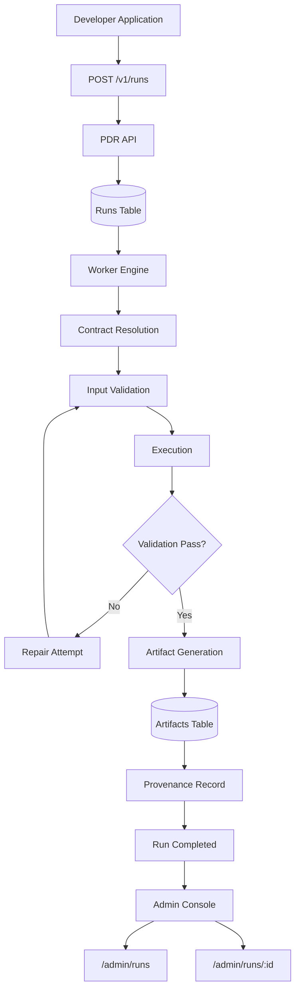

# PerfectDocRoot Architecture

This document describes the core architecture of the PerfectDocRoot (PDR) platform.

PerfectDocRoot provides a **governed execution layer for AI workflows**, ensuring that every run produces structured, inspectable results.

---

## Architecture Overview

PerfectDocRoot sits between an application and AI systems, introducing governance, validation, artifact tracking, and provenance recording.

Instead of executing AI prompts directly, workflows pass through the PDR execution engine.

---

## System Architecture Diagram



---
## Architectural Layers

The PDR system can be understood as three layers.

### 1. Application Layer

The application layer represents the developer's system that wants to execute AI workflows.

Applications interact with PerfectDocRoot through the API.

Example request:

```
POST /v1/runs
```

The request includes:

* domain identifier
* input payload
* optional contract version

---

### 2. Governance Layer

The governance layer is the core of PerfectDocRoot.

It includes:

* the **PDR API**
* the **worker execution engine**
* the **run lifecycle**

This layer ensures that every workflow follows the governed execution model.

#### Responsibilities

The governance layer performs:

* contract resolution
* input validation
* workflow execution
* repair attempts
* artifact generation
* run lifecycle management

---

### 3. Evidence Layer

The evidence layer records everything that occurred during execution.

It includes:

* artifact storage
* provenance records
* admin inspection tools

This layer enables developers to inspect, debug, and audit workflow executions.

---

## Core Components

### PDR API

The API serves as the entry point for workflow execution.

Key responsibilities:

* create runs
* resolve contracts
* store input payloads
* return run metadata
* expose inspection endpoints

Example endpoints:

```
POST /v1/runs
GET /v1/runs/:id
```

---

### Runs Table

Runs represent governed workflow executions.

Each run stores:

```
run_id
domain_id
contract_version
status
created_at
completed_at
```

Run status transitions through the lifecycle:

```
queued → running → succeeded / failed
```

---

### Worker Engine

Workers process runs asynchronously.

The worker system continuously polls the database for queued runs.

Simplified worker loop:

```
while (true)
  claim queued run
  execute workflow
  generate artifacts
  update run status
```

Workers perform the governed execution lifecycle.

---

### Contracts

Contracts define the structure of valid workflow inputs and outputs.

Contracts are versioned and stored in the database.

Example fields:

```
domain_id
contract_version
schema_hash
schema_json
```

During execution, the contract schema is snapshot as an artifact.

Artifact type:

```
contract_snapshot
```

---

### Validation

Before execution begins, input payloads are validated against the contract schema.

Validation results are recorded as artifacts.

Artifact type:

```
validation_report
```

If validation fails, the workflow may enter the repair loop.

---

### Repair Loop

Some workflows support repair attempts when validation fails.

Example sequence:

```
validate → fail
repair attempt
validate → fail
repair attempt
validate → success
```

Repair attempts allow workflows to correct issues before failing completely.

Repair actions are recorded as artifacts.

---

### Artifact Storage

Artifacts capture evidence produced during workflow execution.

Artifacts store metadata including:

```
artifact_id
artifact_type
content_hash
size_bytes
created_at
```

Artifacts are associated with runs.

Example artifact types:

```
contract_snapshot
validation_report
analysis_output
execution_steps
repair_attempt
provenance
```

---

### Provenance

Provenance records the lineage of the workflow execution.

Provenance includes:

* contract version used
* validation results
* execution steps
* artifact lineage
* repair attempts

This allows developers to reconstruct and analyze runs later.

---

### Admin Console

The admin console provides an inspection interface for developers and operators.

Example pages include:

```
/admin/contracts
/admin/runs
/admin/runs/:id
/admin/workers
```

From the console developers can inspect:

* run inputs
* validation reports
* execution steps
* artifacts
* provenance

---

## Example Execution Flow

A typical workflow execution proceeds as follows.

```
1. Application sends POST /v1/runs
2. PDR API creates a run record
3. Run enters queued state
4. Worker claims the run
5. Contract is resolved
6. Input payload is validated
7. Workflow execution occurs
8. Artifacts are generated
9. Provenance is recorded
10. Run is marked succeeded
```

The run can then be inspected through the API or admin console.

---

## Why This Architecture Matters

Traditional AI workflows often produce opaque responses that are difficult to debug or audit.

PerfectDocRoot introduces a governed execution model that ensures workflows produce:

* structured outputs
* validation evidence
* artifact lineage
* reproducible execution history

This makes AI workflows suitable for environments where reliability and traceability are required.

---
